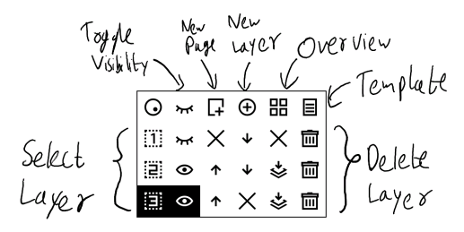

# xovi extensions for the toolbar

The QMD files in this repo add a quicktools-like floating bar, and a layer management bar. Instructions to install xovi can be found in [here](https://github.com/asivery/rmpp-xovi-extensions/blob/master/INSTALL.MD). 
After which, copy the files to 
`/home/root/xovi/exthome/qt-resource-rebuilder/` and restart xovi. The `Edit.qmd` file adds a trash-can icon to the selection helper, which lets the user delete the stroke selected instead of cutting and clearing the clipboard

These QMDs were tested to work in 3.15/16 and 3.17. Please download the respective version of the simplified.qmd file for the versions. Any bugs should be reported in the repo issues. 

## Features

- Allows adding any tool with a preset colour and thickness
- Allows changing the added tool order
- Can be placed anywhere in the screen
- Can be minimised when not in use
- Snaps to the edges and horizontal/vertical center of the screen when moved
- Config persists between restarts(Enabled state, position, tools list)
- 3 Presets of tools to change to
- Floating Layers menu fully replaces system equivalent except for renaming the layer

## How-To
#### To enable the floating toolbars, use the menu in the toolbar
The preset option lets you have a preset of Quick-Tools tools
 

## Quick-Tools 

### Moving the toolbars
#### Press and hold the left-most icon until it's highlighted. After which, press and drag the icon to move it around

#### Fully open(Toolbar visible)

#### Without tool order

 
#### Partially closed(Toolbar closed)

#### Fully minimised(Double tap the left-most icon)

#### To add Tools

#### To change tool order
To change the tool order, press and hold on any tool button(s) to show the arrows, and change the order using them. Note: The arrows won't show up unless you have the base toolbar open.

## Layers
#### Layer-management floating toolbar

#### Viewing Layer name
Press and hold the layer number to view the corresponding layer name.

